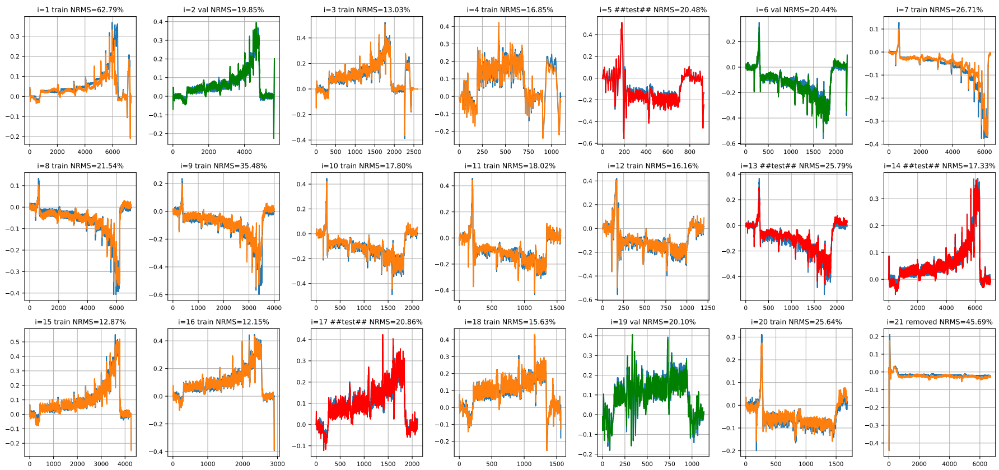
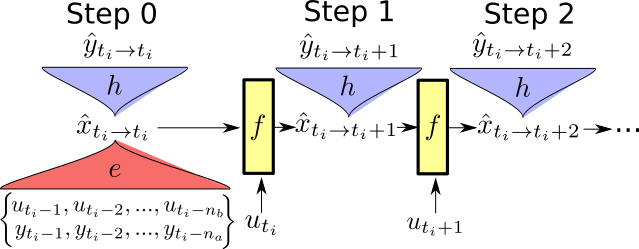

# State-space encoder model applied on the Nissan leaf steering dataset

The code accompanying a publich paper at SysID 2021. [link](https://arxiv.org/abs/2105.04529)

`Rödönyi, G., Beintema, G. I., Tóth, R., Schoukens, M., Pup, D., Kisari, Á., ... & Bokor, J. (2021). Identification of the nonlinear steering dynamics of an autonomous vehicle. arXiv preprint arXiv:2105.04529.`

Model Simulation result:

Note; code has been updated after publishing to be compatiable with the new version of deepSI (0.3.0), the old version can still be found in the log.

# Instructions

* Get anaconda 3 (python>= 3.6)
* Install pytorch ([Instructions](https://pytorch.org/get-started) CUDA optional)
* Install [deepSI](https://github.com/GerbenBeintema/deepSI) (our preliminary toolbox 0.3.0 current code) (original code used `168d2efd36154a27e653be705c6d559170661d2a`)
  * `git clone git@github.com:GerbenBeintema/deepSI.git` 
  * `cd deepSI`
  * `pip install -e .`
* install jupyter notebook
  * (i.e. `conda install -c conda-forge jupyterlab`)
* Use jupyter notebooks to open notebooks.
  * (e.g. `jupyter notebook SS-encoder-modelling.ipynb`)

# State-space encoding structure

